# 개요 
- django, postgres, heroku를 이용해서 배포를 하도록 해본다. 

# 사전 설치
- Python, Git는 사전에 설치가 되어야 한다. 

## SSH 키 설정
- SSH 키를 통해 3rd Party와 연동을 보다 쉽게 할 수 있도록 도와준다. 
- .ssh 폴더를 생성한다. 
```bash
$ mkdir .ssh
```

- .ssh 폴더로 이동한 뒤, ssh-keygen.exe를 실행한다. 
- 이 때, PASSWORD를 기억한다. 여기에서는 temp1234로 지정했다. 
```bash
$ cd .ssh && ssh-keygen.exe
Generating public/private rsa key pair.
Enter file in which to save the key (/c/Users/your_name/.ssh/id_rsa):     
Created directory '/c/Users/your_name/.ssh'.
Enter passphrase (empty for no passphrase):
Enter same passphrase again: 
Your identification has been saved in /c/Users/your_name/.ssh/id_rsa
Your public key has been saved in /c/Users/your_name/.ssh/id_rsa.pub
The key fingerprint is:
SHA256:va+rqu6XdFRnt/eMkHo02MYZNZOBAUV14YmEW/nbmGQ evanjung@evan
The key's randomart image is:
+---[RSA 3072]----+
.
.
+----[SHA256]-----+
```

- ssh 키 값이 잘 설치가 되었는지 확인한다. 
```bash
$ cd ~/.ssh && ls
id_rsa  id_rsa.pub
```

## Heroku 설치
- URL : https://devcenter.heroku.com/articles/heroku-cli#install-the-heroku-cli
- 여기에서 윈도우 설치 파일을 클릭한다. 
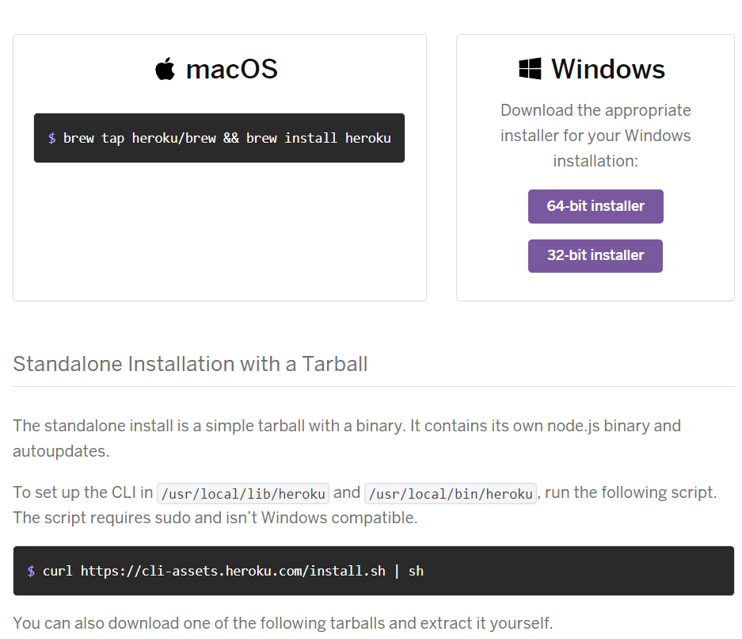

- 설치 시, 아래 그림처럼 모두 체크가 되어 있는지 확인한다. 
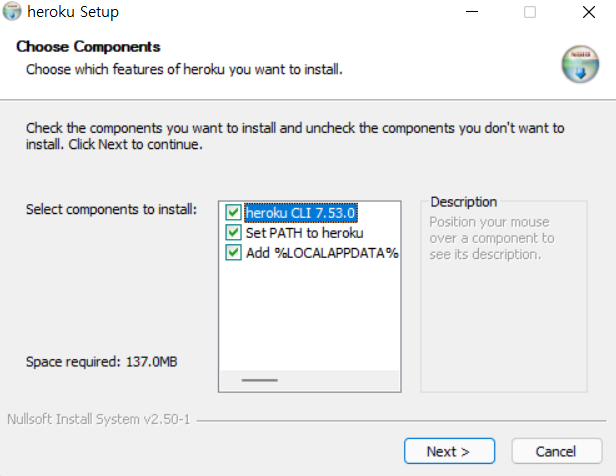

- 버전 확인을 하도록 한다. 
    + Warning 메시지를 클릭하면 로그인 화면이 나타난다. 회원가입을 별도로 진행하면 될 것이다.
```bash
$ heroku --version
 »   Warning: Our terms of service have changed: https://dashboard.heroku.com/terms-of-service
heroku/7.53.0 win32-x64 node-v12.21.0
```

## 가상환경 설치
- virtualenv 가상환경을 설치한다. 
```bash
$ virtualenv venv
created virtual environment CPython3.9.7.final.0-64 in 6449ms
  creator CPython3Windows(dest=C:\Users\j2hoo\OneDrive\Desktop\django_heroku\venv, clear=False, no_vcs_ignore=False, global=False)
  seeder FromAppData(download=False, pip=bundle, setuptools=bundle, wheel=bundle, via=copy, app_data_dir=C:\Users\j2hoo\AppData\Local\pypa\virtualenv)
    added seed packages: pip==22.0.4, setuptools==62.1.0, wheel==0.37.1
  activators BashActivator,BatchActivator,FishActivator,NushellActivator,PowerShellActivator,PythonActivator
```

## Django 설치
- 가상환경에 접속 후, django를 설치한다. 
```bash
$ source venv/Scripts/activate
(venv) $ pip install django pytz
```

- 여기까지 진행하면 우선 기본 설정은 끝난 것이다. 

# Django App 만들기
- django 웹사이트 프로젝트를 시작한다. 
```bash
$ django-admin startproject mysite
```
- mysite 폴더에 들어가서 python runserver를 실행한다. 
```bash
$ python manage.py runserver
Watching for file changes with StatReloader
Performing system checks...

System check identified no issues (0 silenced).

You have 18 unapplied migration(s). Your project may not work properly until you apply the migrations for app(s): admin, auth, contenttypes, sessions.      
Run 'python manage.py migrate' to apply them.
May 11, 2022 - 23:26:46
Django version 4.0.4, using settings 'mysite.settings'
Starting development server at http://127.0.0.1:8000/
Quit the server with CTRL-BREAK.
[11/May/2022 23:26:49] "GET / HTTP/1.1" 200 10697
[11/May/2022 23:26:49] "GET /static/admin/css/fonts.css HTTP/1.1" 200 423
[11/May/2022 23:26:49] "GET /static/admin/fonts/Roboto-Bold-webfont.woff HTTP/1.1" 200 86184
[11/May/2022 23:26:49] "GET /static/admin/fonts/Roboto-Regular-webfont.woff HTTP/1.1" 200 85876
[11/May/2022 23:26:49] "GET /static/admin/fonts/Roboto-Light-webfont.woff HTTP/1.1" 200 85692
Not Found: /favicon.ico
[11/May/2022 23:26:50] "GET /favicon.ico HTTP/1.1" 404 2110
```

- `http://127.0.0.1:8000/`를 클릭해서 정상적으로 열리는지 확인한다. 

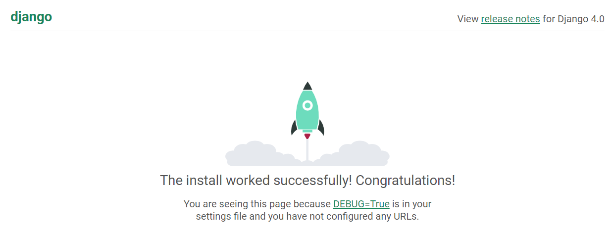

## address_book 설정
- 먼저 Hello World 페이지를 열어보도록 한다. 
- mysite 폴더에서 address_book startapp을 시작한다. 
```bash
$ python manage.py startapp address_book
```

- mysite/settings.py을 열고 아래와 같이 수정한다. 
```python
.
.
INSTALLED_APPS = [
    'django.contrib.admin',
    'django.contrib.auth',
    'django.contrib.contenttypes',
    'django.contrib.sessions',
    'django.contrib.messages',
    'django.contrib.staticfiles',
    'address_book'
]
.
.
```

- mysite/urls.py을 열어서 아래와 같이 코드를 수정한다. 
```python
from django.contrib import admin
from django.urls import path, include

urlpatterns = [
    path('admin/', admin.site.urls),
    path('', include('address_book.urls')),
]
```

- mysite/address_book에서 urls.py를 추가로 생성하고 아래와 같이 코드를 입력한다. 
```python
from django.urls import path
from . import views

urlpatterns = [
    path('', views.home, name='home'), 
]
```

- mysite/address_book에서 views.py를 열고 아래 코드를 추가한다. 
```python
from django.shortcuts import render, redirect

# Create your views here.
def home(request):
    return render(request, 'home.html', {})
```

- address_book 폴더 아래에 templates 폴더를 만든다. 
  + home.html 파일을 생성 후, 아래와 같이 코드를 추가한다. 
```html
<h1>Hello World!</h1>
```


## 웹사이트 기본 꾸미기
- css와 메뉴바, 그리고 adding 페이지를 추가한다. 

### (1) Bootstrap 적용
- 우선 base.html을 만들고, bootstrap css을 적용할 것이다. 
  + URL : https://getbootstrap.com/docs/5.1/getting-started/introduction/
```html
<!doctype html>
<html lang="en">

<head>
    <!-- Required meta tags -->
    <meta charset="utf-8">
    <meta name="viewport" content="width=device-width, initial-scale=1">

    <!-- Bootstrap CSS -->
    <link href="https://cdn.jsdelivr.net/npm/bootstrap@5.1.3/dist/css/bootstrap.min.css" rel="stylesheet"
        integrity="sha384-1BmE4kWBq78iYhFldvKuhfTAU6auU8tT94WrHftjDbrCEXSU1oBoqyl2QvZ6jIW3" crossorigin="anonymous">

    <title>Hello, world!</title>
</head>

<body>
    <nav class="navbar navbar-expand-lg navbar-light bg-light">
        <div class="container-fluid">
            <a class="navbar-brand" href="">Address Book</a>
            <button class="navbar-toggler" type="button" data-bs-toggle="collapse"
                data-bs-target="#navbarSupportedContent" aria-controls="navbarSupportedContent" aria-expanded="false"
                aria-label="Toggle navigation">
                <span class="navbar-toggler-icon"></span>
            </button>
            <div class="collapse navbar-collapse" id="navbarSupportedContent">
                <ul class="navbar-nav me-auto mb-2 mb-lg-0">
                    <li class="nav-item">
                        <a class="nav-link active" aria-current="page" href="#">Add Address</a>
                    </li>
                </ul>
            </div>
        </div>
    </nav>

    <!-- Optional JavaScript; choose one of the two! -->

    <!-- Option 1: Bootstrap Bundle with Popper -->
    <script src="https://cdn.jsdelivr.net/npm/bootstrap@5.1.3/dist/js/bootstrap.bundle.min.js"
        integrity="sha384-ka7Sk0Gln4gmtz2MlQnikT1wXgYsOg+OMhuP+IlRH9sENBO0LRn5q+8nbTov4+1p" crossorigin="anonymous">
    </script>

    <!-- Option 2: Separate Popper and Bootstrap JS -->
    <!--
    <script src="https://cdn.jsdelivr.net/npm/@popperjs/core@2.10.2/dist/umd/popper.min.js" integrity="sha384-7+zCNj/IqJ95wo16oMtfsKbZ9ccEh31eOz1HGyDuCQ6wgnyJNSYdrPa03rtR1zdB" crossorigin="anonymous"></script>
    <script src="https://cdn.jsdelivr.net/npm/bootstrap@5.1.3/dist/js/bootstrap.min.js" integrity="sha384-QJHtvGhmr9XOIpI6YVutG+2QOK9T+ZnN4kzFN1RtK3zEFEIsxhlmWl5/YESvpZ13" crossorigin="anonymous"></script>
    -->
</body>

</html>

```

- home.html에 base.html 파일을 적용한다. 
```html
 


<h1>Hello World!</h1>

```

- 결과는 아래 그림과 같다. 

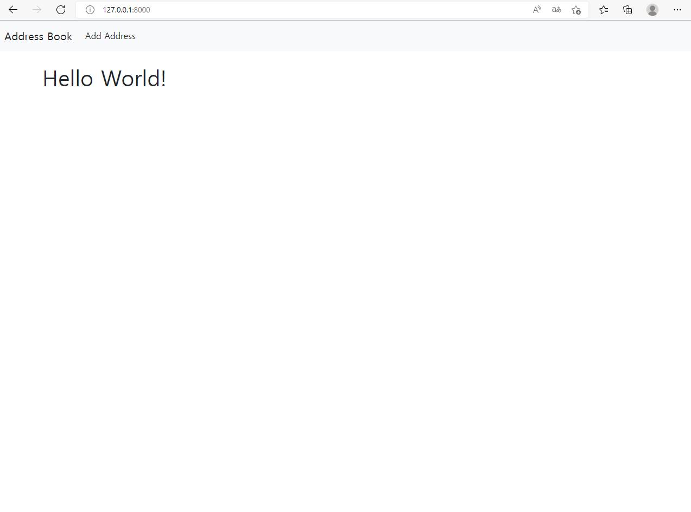

### (2) Adding 페이지 작성
- add_address 페이지를 생성한다. 
- 먼저 address_book/urls.py를 열어 아래코드를 추가한다. 
```python
from django.urls import path
from . import views

urlpatterns = [
    path('', views.home, name='home'), 
    path('add_address', views.add_address, name="add_address"),
]
```

- 이번에는 views.py를 아래 코드를 추가한다. 
```python
.
.
.
def add_address(request):
    return render(request, 'add_address.html', {})
```

- base.html에서 Add Adress 메뉴바의 href를 수정한다. 
```html
            <div class="collapse navbar-collapse" id="navbarSupportedContent">
                <ul class="navbar-nav me-auto mb-2 mb-lg-0">
                    <li class="nav-item">
                        <a class="nav-link active" aria-current="page" href="">Add Address</a>
                    </li>
                </ul>
            </div>
```

- 마지막으로 add_address.html 파일을 만들고 다음과 같이 추가한다. 
```html
 


<h1>Add Adress Page</h1>

```
- add_address 페이지가 정상적으로 만들어졌는지 확인한다. 
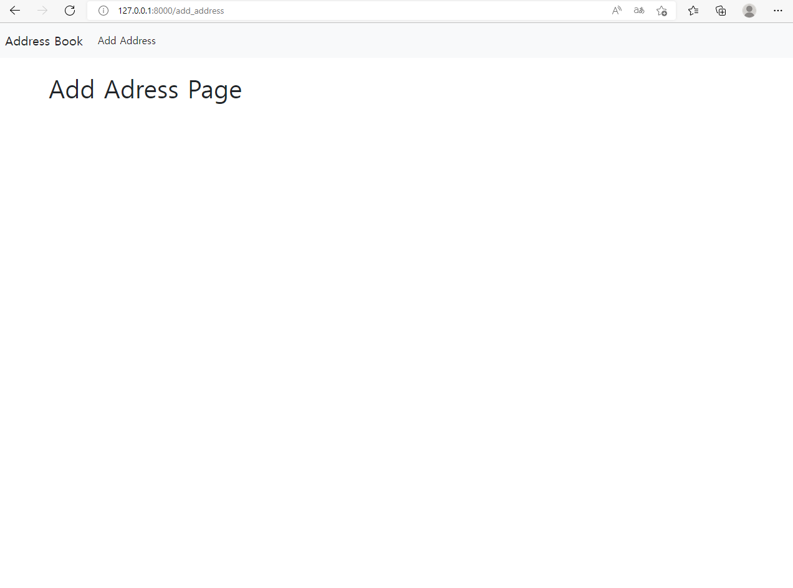

# Heroku App 생성
- 우선 회원가입을 진행해야 한다. 
- 회원가입이 끝난 후, 로그인을 진행한다. 터미널에서 로그인을 진행할 것이다. 

## (1) Heroku App 생성
- 프로젝트 Root 경로에서 로그인을 진행한다. 
```bash
$ heroku login
heroku: Press any key to open up the browser to login or q to 
exit: 
Opening browser to https://cli-auth.heroku.com/auth/cli/browser/...
Logging in... done
Logged in as your_id@email.com
```

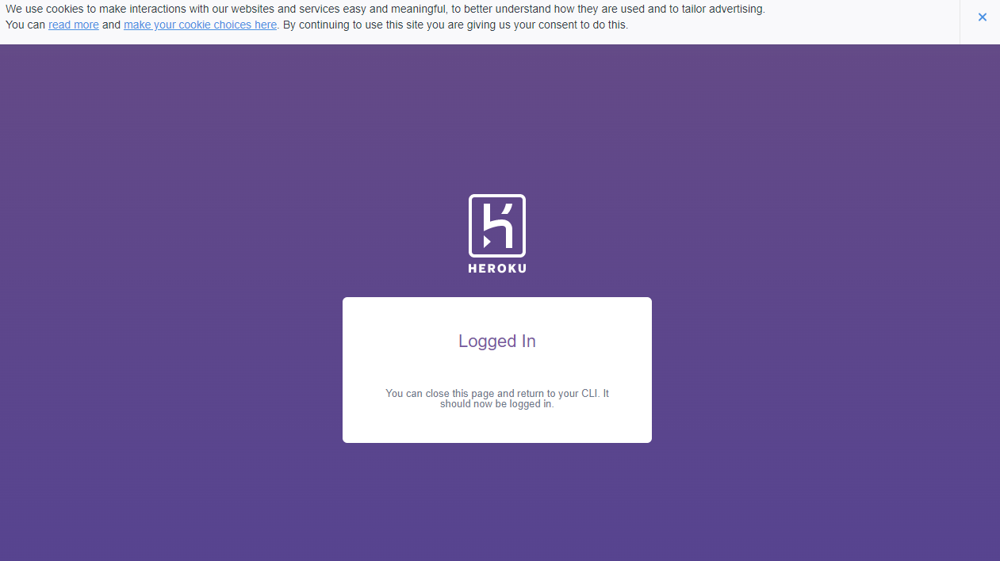

- Heroku 로그인이 완료되면, ssh 키값을 heroku에 전달한다. 
```bash
$ heroku keys:add
 »   Warning: heroku update available from 7.53.0 to 7.60.2.
Found an SSH public key at C:\Users\human\.ssh\id_rsa.pub
? Would you like to upload it to Heroku? Yes
Uploading C:\Users\human\.ssh\id_rsa.pub SSH key... done 
```

- 프로젝트 Root 경로에서 heroku create를 실행한다. 
```bash
$ heroku create
 »   Warning: heroku update available from 7.53.0 to 7.60.2.
Creating app... done, ⬢ calm-sands-83541
https://calm-sands-83541.herokuapp.com/ | https://git.heroku.com/calm-sands-83541.git
```

- 생성된 URL을 웹페이지에서 확인해본다. 
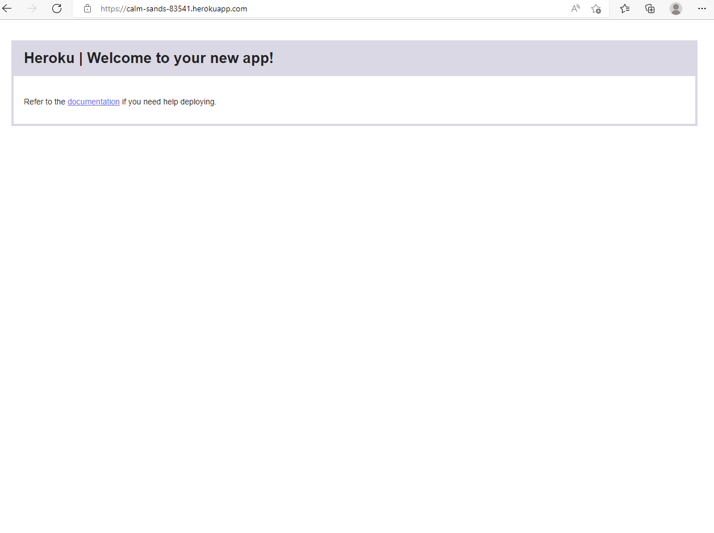

- mysite/settings.py에서 각 개인의 `SECRET_KEY`의 키값을 복사한다. 
  + 아래는 가
```python
SECRET_KEY = 'django-insecure-xi5^9p)wa+qtio7m&mz4#_563+&_a=ii52aopfb#48t-%ii!ry'
```

### (2) 라이브러리 및 환경설정 
- 이제 Heroku 사이트에서 키값을 추가한다. 
  + Heroku Dashboard에서 각자 생성된 앱을 클릭한다. 
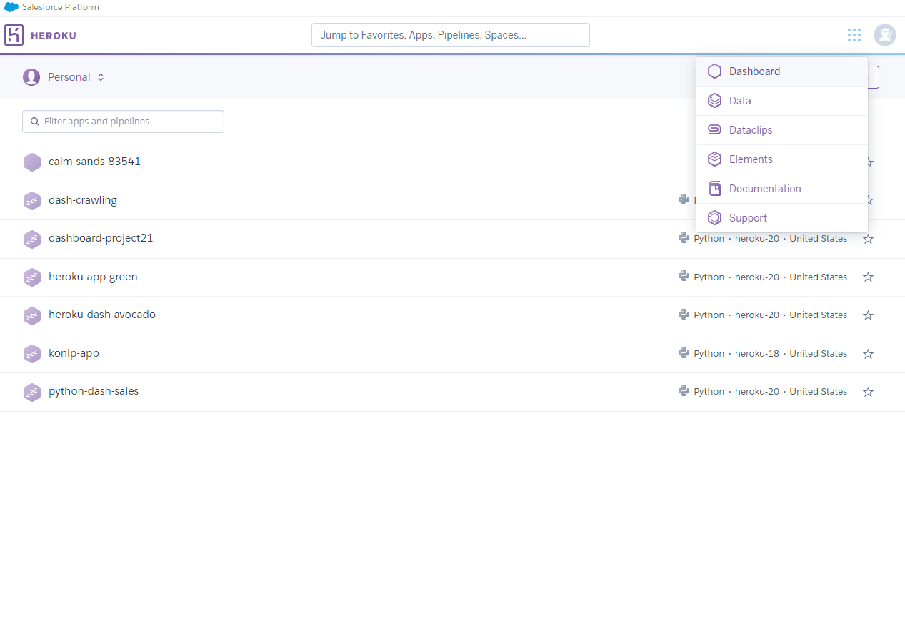

- Config Vars 탭에서 아래와 같이 입력 후 저장한다. 
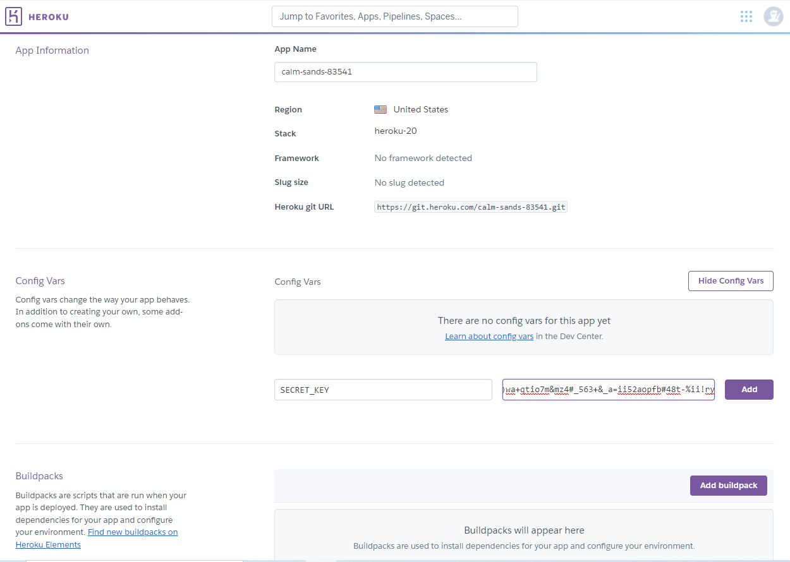

- 이번에는 gunicorn을 설치한다. 
```bash
$ pip install gunicorn django-heroku python-decouple
```

- 지금까지 설치된 라이브러리는 아래와 같다. 
```bash
$ pip freeze
asgiref==3.5.1
dj-database-url==0.5.0
Django==4.0.4
django-heroku==0.3.1
gunicorn==20.1.0
psycopg2==2.9.3
python-decouple==3.6
pytz==2022.1
sqlparse==0.4.2
tzdata==2022.1
whitenoise==6.1.0
```

### (3) 환경설정 변경
- mysite/settings.py을 아래와 같이 추가한다. 
```python
# 라이브러리 추가 
from pathlib import Path
import os 
import django_heroku
from decouple import config
import dj_database_url

.
.
# SECURITY WARNING: keep the secret key used in production secret!
SECRET_KEY = config('SECRET_KEY')
SECRET_KEY = 'django-insecure-xi5^9p)wa+qtio7m&mz4#_563+&_a=ii52aopfb#48t-%ii!ry'

.
.
# Static files (CSS, JavaScript, Images)
# https://docs.djangoproject.com/en/4.0/howto/static-files/

STATIC_URL = 'static/'
django_heroku.settings(locals())
```

- 일반적으로 KEY값은 github에 올리면 안된다. 따라서, .env 파일을 생성 후, 여기에 SECRET_KEY 키값을 복사한다. 그리고, settings.py에서 SECRET_KEY은 삭제한다.
  + .env
```bash
SECRET_KEY = 'django-insecure-xi5^9p)wa+qtio7m&mz4#_563+&_a=ii52aopfb#48t-%ii!ry'
```

  + .gitignore 파일에서 .env만 추가로 입력한다. 
```markdown
.env
```

### (4) Whitenoise
- mysite/static 폴더를 만들고 __init__.py를 추가한다. 
- settings.py에서 아래 코드를 추가한다. 
```python
STATIC_URL = '/static/'
STATICFILES_DIRS = [
    os.path.join(BASE_DIR, 'static')
]

STATICFILES_STORAGE = 'whitenoise.storage.CompressedManifestStaticFilesStorage'

django_heroku.settings(locals())
```

- 이번에는 MIDDLEWARE에 다음 코드를 추가한다. 
```python
MIDDLEWARE = [
    'django.middleware.security.SecurityMiddleware',
    "whitenoise.middleware.WhiteNoiseMiddleware",
    'django.contrib.sessions.middleware.SessionMiddleware',
    'django.middleware.common.CommonMiddleware',
    'django.middleware.csrf.CsrfViewMiddleware',
    'django.contrib.auth.middleware.AuthenticationMiddleware',
    'django.contrib.messages.middleware.MessageMiddleware',
    'django.middleware.clickjacking.XFrameOptionsMiddleware',
]
```

# 배포 준비 
## (1) 배포 환경 설정
- Procfile을 생성한다. 
  + mysite는 프로젝트 폴더를 말한다. 
```
web: gunicorn mysite.wsgi:application --log-file - --log-level debug
heroku ps:scale web=1
python manage.py collectstatic --noinput
manage.py migrate
```

- runtime.txt 파일을 생성한다. 
```
python-3.9.7
```

- requirements.txt 파일을 생성한다. 
```bash
$ pip freeze > requirements.txt
$ cat requirements.txt 
asgiref==3.5.1
dj-database-url==0.5.0
Django==4.0.4
django-heroku==0.3.1
gunicorn==20.1.0
psycopg2==2.9.3
python-decouple==3.6
pytz==2022.1
sqlparse==0.4.2
tzdata==2022.1
whitenoise==6.1.0
```

- 이제 runserver를 실행한다. 
  + 만약 http://127.0.0.1:8000/admin 실행 시, no such table: django_session 에러가 나타나면 다음 코드를 실행한다. 
```bash
$ python manage.py migrate
System check identified some issues:

WARNINGS:
?: (staticfiles.W004) The directory 'C:\Users\human\Des
ktop\django_heroku\mysite\static' in the STATICFILES_DIRS setting does not exist.
Operations to perform:
  Apply all migrations: admin, auth, contenttypes, ses
sions
Running migrations:
  Applying contenttypes.0001_initial... OK
  Applying auth.0001_initial... OK
  Applying admin.0001_initial... OK
  Applying admin.0002_logentry_remove_auto_add... OK
m
  Applying admin.0003_logentry_add_action_flag_choices...
1m OK
  Applying contenttypes.0002_remove_content_type_name...      
m OK
  Applying auth.0002_alter_permission_name_max_length...
m OK
  Applying auth.0003_alter_user_email_max_length... OK
[0m
  Applying auth.0004_alter_user_username_opts... OK

  Applying auth.0005_alter_user_last_login_null... OK
0m
  Applying auth.0006_require_contenttypes_0002... OK
m
  Applying auth.0007_alter_validators_add_error_messages...   
2;1m OK
  Applying auth.0008_alter_user_username_max_length...        
OK
  Applying auth.0009_alter_user_last_name_max_length...
 OK
  Applying auth.0010_alter_group_name_max_length... OK

  Applying auth.0011_update_proxy_permissions... OK

  Applying auth.0012_alter_user_first_name_max_length...      
 OK
  Applying sessions.0001_initial... OK
```

- DB 접근 위한 유저를 생성한다. 
  + PW: temp1234
```bash
$ python manage.py createsuperuser
Username (leave blank to use 'human'): 
Email address: j2hoon85@naver.com
Password: 
Password (again):
This password is too common.
Bypass password validation and create user anyway? [y/N]: 
y
Superuser created successfully.
```

- 이제 다시 runserver를 실행하여 DB에 접근하는지 확인한다. 
```bash
$ python manage.py runserver
```
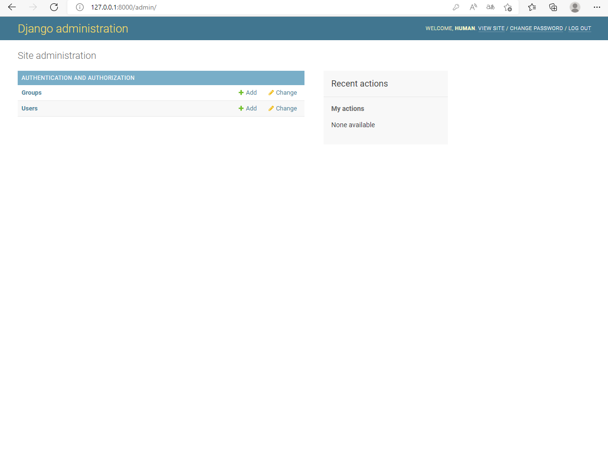

## Heroku에 배포
- 배포 전 프로젝트 파일을 확인한다. 
  + tree 명령어를 실행하려면 다음을 참조한다. 
  + URL : https://frozenrainyoo.tistory.com/3
```
$ tree -L 3
.
|-- Procfile
|-- README.md
|-- address_book
|   |-- __init__.py
|   |-- __pycache__
|   |   |-- __init__.cpython-39.pyc
|   |   |-- admin.cpython-39.pyc
|   |   |-- apps.cpython-39.pyc
|   |   |-- models.cpython-39.pyc
|   |   |-- urls.cpython-39.pyc
|   |   `-- views.cpython-39.pyc
|   |-- admin.py
|   |-- apps.py
|   |-- migrations
|   |   |-- __init__.py
|   |   `-- __pycache__
|   |-- models.py
|   |-- templates
|   |   |-- add_address.html
|   |   |-- base.html
|   |   `-- home.html
|   |-- tests.py
|   |-- urls.py
|   `-- views.py
|-- db.sqlite3
|-- manage.py
|-- mysite
|   |-- __init__.py
|   |-- asgi.py
|   |-- settings.py
|   |-- urls.py
|   `-- wsgi.py
|-- requirements.txt
|-- runtime.txt
|-- static
|   `-- __init__.py
`-- staticfiles
```

- mysite/settings.py는 다음과 같다. 
```python
"""
Django settings for mysite project.

Generated by 'django-admin startproject' using Django 4.0.4.

For more information on this file, see
https://docs.djangoproject.com/en/4.0/topics/settings/

For the full list of settings and their values, see
https://docs.djangoproject.com/en/4.0/ref/settings/
"""

from pathlib import Path
import os 
import django_heroku
from decouple import config
import dj_database_url

# Build paths inside the project like this: BASE_DIR / 'subdir'.
BASE_DIR = Path(__file__).resolve().parent.parent


# Quick-start development settings - unsuitable for production
# See https://docs.djangoproject.com/en/4.0/howto/deployment/checklist/

# SECURITY WARNING: keep the secret key used in production secret!
SECRET_KEY = config('SECRET_KEY')

# SECURITY WARNING: don't run with debug turned on in production!
# DEBUG = True
DEBUG = False

ALLOWED_HOSTS = ['*']


# Application definition

INSTALLED_APPS = [
    'django.contrib.admin',
    'django.contrib.auth',
    'django.contrib.contenttypes',
    'django.contrib.sessions',
    'django.contrib.messages',
    'django.contrib.staticfiles',
    'address_book'
]

MIDDLEWARE = [
    'django.middleware.security.SecurityMiddleware',
    'whitenoise.middleware.WhiteNoiseMiddleware',
    'django.contrib.sessions.middleware.SessionMiddleware',
    'django.middleware.common.CommonMiddleware',
    'django.middleware.csrf.CsrfViewMiddleware',
    'django.contrib.auth.middleware.AuthenticationMiddleware',
    'django.contrib.messages.middleware.MessageMiddleware',
    'django.middleware.clickjacking.XFrameOptionsMiddleware',
]

ROOT_URLCONF = 'mysite.urls'

TEMPLATES = [
    {
        'BACKEND': 'django.template.backends.django.DjangoTemplates',
        'DIRS': ['address_book/templates/'],
        'APP_DIRS': True,
        'OPTIONS': {
            'context_processors': [
                'django.template.context_processors.debug',
                'django.template.context_processors.request',
                'django.contrib.auth.context_processors.auth',
                'django.contrib.messages.context_processors.messages',
            ],
        },
    },
]

WSGI_APPLICATION = 'mysite.wsgi.application'


# Database
# https://docs.djangoproject.com/en/4.0/ref/settings/#databases

DATABASES = {
    'default': {
        'ENGINE': 'django.db.backends.sqlite3',
        'NAME': BASE_DIR / 'db.sqlite3',
    }
}


# Password validation
# https://docs.djangoproject.com/en/4.0/ref/settings/#auth-password-validators

AUTH_PASSWORD_VALIDATORS = [
    {
        'NAME': 'django.contrib.auth.password_validation.UserAttributeSimilarityValidator',
    },
    {
        'NAME': 'django.contrib.auth.password_validation.MinimumLengthValidator',
    },
    {
        'NAME': 'django.contrib.auth.password_validation.CommonPasswordValidator',
    },
    {
        'NAME': 'django.contrib.auth.password_validation.NumericPasswordValidator',
    },
]


# Internationalization
# https://docs.djangoproject.com/en/4.0/topics/i18n/

LANGUAGE_CODE = 'en-us'

TIME_ZONE = 'UTC'

USE_I18N = True

USE_TZ = True


# Static files (CSS, JavaScript, Images)
# https://docs.djangoproject.com/en/4.0/howto/static-files/
STATIC_ROOT = os.path.join(BASE_DIR, 'staticfiles')
STATIC_URL = '/static/'

# Extra places for collectstatic to find static files.
STATICFILES_DIRS = (
    os.path.join(BASE_DIR, 'static'),
)

STATICFILES_STORAGE = 'whitenoise.storage.CompressedManifestStaticFilesStorage'

django_heroku.settings(locals())

# Default primary key field type
# https://docs.djangoproject.com/en/4.0/ref/settings/#default-auto-field

DEFAULT_AUTO_FIELD = 'django.db.models.BigAutoField'

# Heroku: Update database configuration from $DATABASE_URL.
db_from_env = dj_database_url.config(conn_max_age=500)
DATABASES['default'].update(db_from_env)
```

- 우선 현재 모든 프로젝트 파일을 github에 추가한다. 
```bash
$ git add .
$ git commit -m "heroku update"
$ git push
$ git push heroku main
```

- URL : https://django-heroku-human01.herokuapp.com/
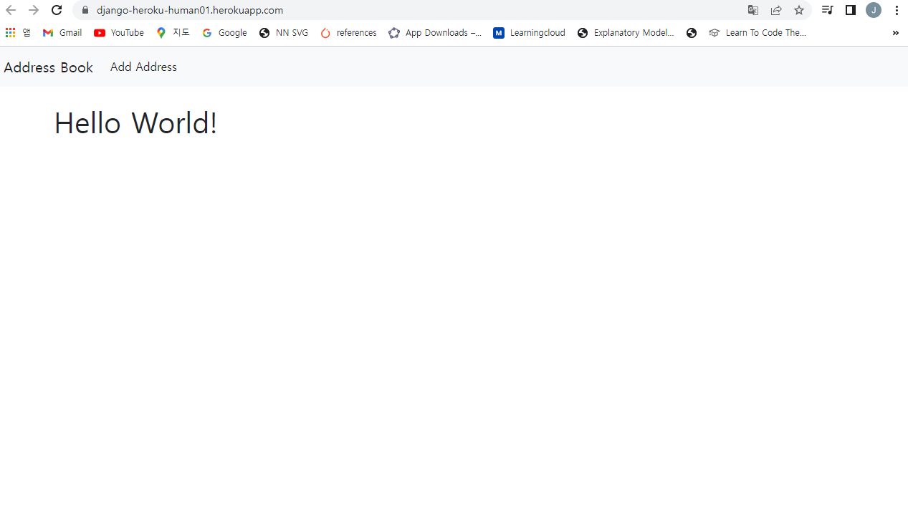